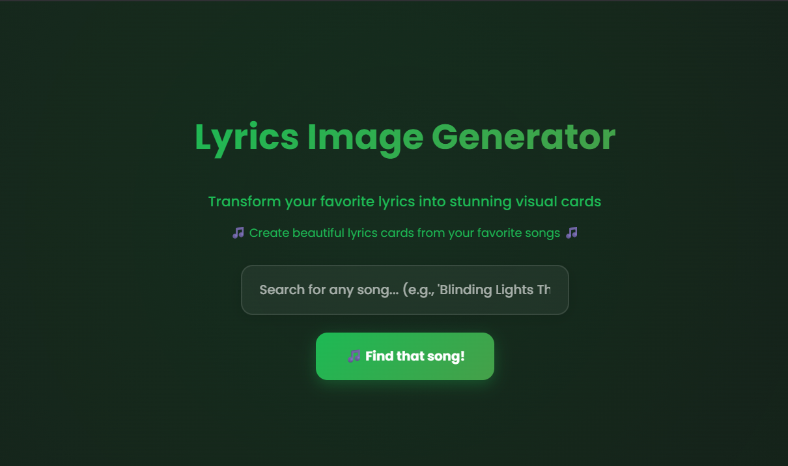

# 🎵 Lyricify - Spotify Style Card Generator



> Transform your favorite song lyrics into stunning visual cards with Spotify-style design

[](https://soumyaexe.github.io/Lyricify/)
[](https://github.com/SoumyaEXE/Lyricify/stargazers)
[](https://github.com/SoumyaEXE/Lyricify/network)
[](LICENSE)

## ✨ Features

### 🎨 **Visual Customization**
- **Text Size Control** - Adjust lyrics and title sizes with precision sliders
- **Card Corner Radius** - Customize rounded corners for modern aesthetics
- **Album Cover Sizing** - Scale album artwork to your preference
- **Color Themes** - Choose from curated Spotify-inspired color palettes
- **Custom Colors** - Pick any color with the built-in color picker

### 🎵 **Music Integration**
- **Spotify Search** - Find any song from Spotify's vast catalog
- **Lyrics Fetching** - Automatically retrieve song lyrics
- **Line Selection** - Choose specific lyric lines for your card
- **Artist & Track Info** - Display song metadata beautifully

### 📱 **User Experience**
- **Responsive Design** - Perfect on desktop, tablet, and mobile
- **Dark/Light Mode** - Toggle between themes
- **Real-time Preview** - See changes instantly
- **4K Downloads** - High-quality PNG exports
- **Background Options** - Add shadows and backgrounds

## 🚀 Quick Start

### Live Demo
Visit [Lyricify](https://lyricifyy.vercel.app) to try it instantly!

### Local Setup
```bash
# Clone the repository
git clone https://github.com/SoumyaEXE/Lyricify.git

# Navigate to the project directory
cd Lyricify

# Open in your preferred web server
# Option 1: Using Live Server in VS Code
# Option 2: Using Python
python -m http.server 8000

# Open http://localhost:8000 in your browser
```

## 🎯 How to Use

1. **Search for a Song** 🔍
   - Enter song name and artist in the search box
   - Example: "Blinding Lights The Weeknd"

2. **Select Your Song** 🎵
   - Choose from the search results
   - View album covers and artist information

3. **Pick Lyrics** 📝
   - Select the lines you want on your card
   - Mix and match different verses

4. **Customize Design** 🎨
   - Adjust text size, corners, and album size
   - Choose colors and themes
   - Toggle light/dark text and backgrounds

5. **Download & Share** 📥
   - Export in high-quality 4K resolution
   - Share your beautiful lyric cards

## 🛠️ Tech Stack

- **Frontend**: HTML5, CSS3, JavaScript (ES6+)
- **APIs**: Spotify Web API, Lyrics API
- **Libraries**: 
  - [html2canvas](https://html2canvas.hertzen.com/) - Canvas rendering
  - [FileSaver.js](https://github.com/eligrey/FileSaver.js/) - File downloads
  - [Material Symbols](https://fonts.google.com/icons) - Icons
- **Fonts**: [Poppins](https://fonts.google.com/specimen/Poppins) from Google Fonts

## 📱 Screenshots

<details>
<summary>Click to view screenshots</summary>

### Landing Page


### Song Selection


### Lyrics Selection


### Card Customization


</details>

## 🎨 Color Themes

Lyricify comes with carefully selected Spotify-inspired color themes:

- 🔵 **Ocean Blue** - #008fd1
- 🌊 **Teal** - #549aab
- 🍃 **Lime Green** - #8fc00c
- 🌿 **Forest Green** - #729962
- 🟤 **Earth** - #a2904e
- 🟠 **Orange** - #cd6800
- 🔴 **Red** - #fc302f

## 🔧 Configuration

The app uses several configurable constants in `classes/DOMHandler.js`:

```javascript
const SONGS_TO_FETCH = 10;              // Number of search results
const DOWNLOAD_SCALING_FACTOR = 8;      // 4K quality downloads
const BACKGROUND_SHADOW_BLUR = 20;      // Shadow blur intensity
```

## 🤝 Contributing

Contributions are welcome! Here's how you can help:

1. **Fork the repository**
2. **Create a feature branch**
   ```bash
   git checkout -b feature/AmazingFeature
   ```
3. **Commit your changes**
   ```bash
   git commit -m 'Add some AmazingFeature'
   ```
4. **Push to the branch**
   ```bash
   git push origin feature/AmazingFeature
   ```
5. **Open a Pull Request**

### 🐛 Bug Reports
Found a bug? Please open an issue with:
- Clear description
- Steps to reproduce
- Expected vs actual behavior
- Screenshots (if applicable)

### 💡 Feature Requests
Have an idea? Open an issue and describe:
- The feature you'd like
- Why it would be useful
- Any implementation ideas

## 📄 License

This project is licensed under the MIT License - see the [LICENSE](LICENSE) file for details.

## 🙏 Acknowledgments

- **Spotify** - For inspiration and design guidelines
- **Open Source Community** - For the amazing libraries used
- **Contributors** - Everyone who helps improve Lyricify

## 📞 Contact

**Soumya** - [@SoumyaEXE](https://github.com/SoumyaEXE)

- 🐙 GitHub: [SoumyaEXE](https://github.com/SoumyaEXE)
- 📷 Instagram: [@9n9vc](https://instagram.com/9n9vc)
- 🌐 Project Link: [Lyricify](https://github.com/SoumyaEXE/Lyricify)

---

<div align="center">

**⭐ Star this repository if you found it helpful!**

Made with 💚 by [Soumya](https://github.com/SoumyaEXE)

</div>
